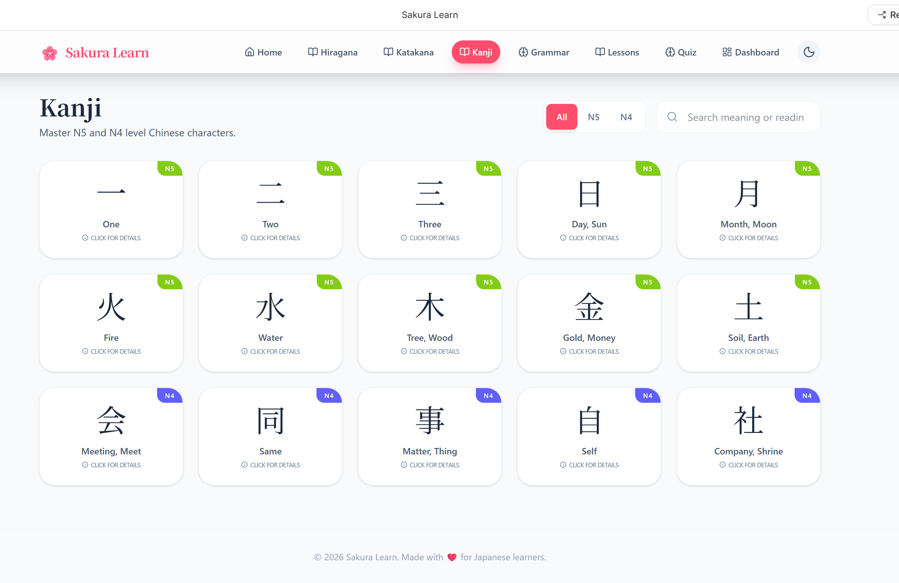

# 🇯🇵 Japanese Learning Web App

A modern, responsive frontend web application designed to help beginners learn **Hiragana**, **Katakana**, and **basic Japanese vocabulary** through interactive lessons and quizzes.

---

## 🚀 Features

- 📚 Learn **Hiragana** and **Katakana** with interactive character cards  
- 🧠 Beginner-friendly **Japanese lessons** (greetings, numbers, common phrases)  
- 📝 **Quiz system** with multiple choice questions and instant feedback  
- 💾 **Progress tracking** using localStorage  
- 🌙 **Dark mode** support  
- 🔊 Basic **pronunciation feature** (Web Speech API / audio support)  
- 📱 Fully **responsive design** (mobile, tablet, desktop)  
- 🎨 Clean and modern UI with smooth user experience  

---

## 📸 Screenshot



## 🛠️ Tech Stack

- React (Vite)  
- Tailwind CSS  
- JavaScript (ES6+)  
- LocalStorage (for saving progress)  

---

## ⚙️ Installation & Setup

1. Clone the repository:
```bash
git clone https://github.com/mohakamran/japanese-learning-app.git
```
## ⚙️ Setup

```bash
npm install
npm run dev
